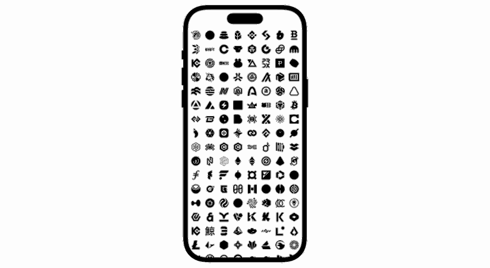

# Web3 Icons for SwiftUI

All ~1,810 **mono** [web3icons](https://github.com/0xa3k5/web3icons) — crypto tokens, networks, wallets, and exchanges — native to SwiftUI.

Each icon is a generated `SwiftUI.Shape` — no SVG library, no XML parser, no image assets. The library is a thin View on top of `Path`, and your icons participate in SwiftUI like any other shape: scale to any size, take color from `.foregroundStyle`, animate, mask, combine.

<p align="center">
  
</p>

## Why this library

- **Pure SwiftUI** — every icon is a `Shape` whose `path(in:)` is committed Swift code, generated at build time from the upstream SVG. Nothing is parsed at runtime.
- **Filled, vector, all the way down** — web3icons mono are solid shapes; this library fills them with your foreground style, sharp at any size on any display. No PNG/PDF rasters bundled.
- **Zero runtime dependencies** — depends only on SwiftUI itself.
- **SwiftUI-idiomatic** — `Web3Icons(.tokenBTC).foregroundStyle(.orange).frame(width: 32, height: 32)` works exactly the way you'd expect.
- **Type-safe by default** — the `Web3Icon` enum gives you autocomplete and compile-time guarantees. A runtime-string lookup is also available for dynamic UIs (`Web3Icons("token/BTC")`).
- **Tracks upstream automatically** — a scheduled workflow watches `@web3icons/core` on npm and opens a PR whenever a new release ships. Package versions mirror it exactly.

## Requirements

- iOS 17+ / macOS 14+
- Swift 6.0+ (Xcode 16+)

## Installation

Add the package to your `Package.swift`:

```swift
dependencies: [
    .package(url: "https://github.com/bring-shrubbery/web3icons-swift.git", from: "4.0.51"),
]
```

Then add `Web3Icons` as a dependency of your target:

```swift
.target(
    name: "YourTarget",
    dependencies: [
        .product(name: "Web3Icons", package: "web3icons-swift"),
    ]
)
```

Or in Xcode: **File → Add Package Dependencies…** and paste the repo URL.

## Usage

```swift
import SwiftUI
import Web3Icons

struct ContentView: View {
    var body: some View {
        Web3Icons(.tokenBTC)
            .foregroundStyle(.orange)
            .frame(width: 32, height: 32)
    }
}
```

Icons are named `<category><Name>`, one flat `Web3Icon` enum across all four categories:

```swift
Web3Icons(.tokenETH)          // crypto tokens — uppercase tickers
Web3Icons(.networkEthereum)   // blockchain networks
Web3Icons(.walletPhantom)     // wallets
Web3Icons(.exchangeUniswap)   // exchanges
```

Dynamic lookup by raw value (`"<category>/<name>"`, returns `nil` if unknown):

```swift
if let icon = Web3Icons("token/BTC") {
    icon.foregroundStyle(.primary)
}
```

## How it's generated

`Tools/generate-icons.mjs` installs [`@web3icons/core`](https://www.npmjs.com/package/@web3icons/core) and [`svg-to-swiftui-core`](https://github.com/bring-shrubbery/SVG-to-SwiftUI), converts every mono SVG into a Swift `Shape`, and writes the `Web3Icon` enum. Run `node Tools/generate-icons.mjs --help` for usage.

## Support

If `web3icons-swift` is useful to you, two ways to say thanks:

- Star the repo on GitHub: [bring-shrubbery/web3icons-swift](https://github.com/bring-shrubbery/web3icons-swift)
- Follow the author on X for updates: [@bringshrubberyy](https://x.com/bringshrubberyy)

## Credits

- [**web3icons**](https://github.com/0xa3k5/web3icons) by [0xa3k5](https://github.com/0xa3k5) — the icon set itself: crypto tokens, networks, wallets, and exchanges, licensed MIT. This package would not exist without that work.
- [**SVG to SwiftUI**](https://github.com/bring-shrubbery/svg-to-swiftui) by [bring-shrubbery](https://github.com/bring-shrubbery) — the converter that turns each SVG into a SwiftUI `Shape`. Its `svg-to-swiftui-core` package powers the `Tools/generate-icons.mjs` pipeline that produces every file under `Sources/Web3Icons/Icons/`.

## License

This Swift package is licensed under the MIT License — see [LICENSE](LICENSE). The upstream [web3icons](https://github.com/0xa3k5/web3icons) icon set is also MIT licensed.
